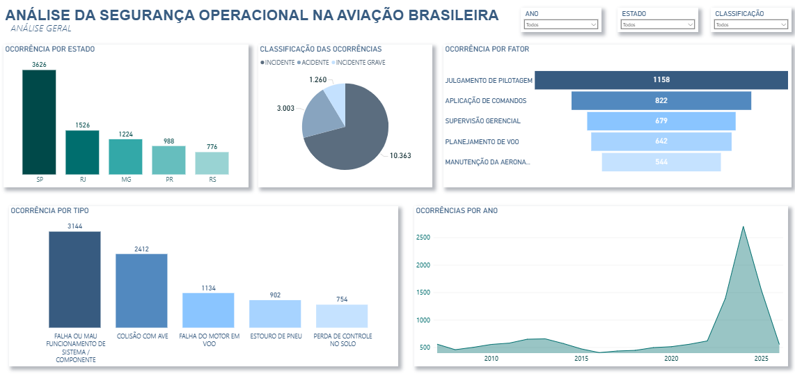
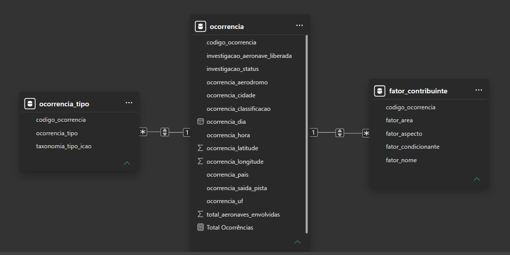

# ✈️ Análise da Segurança Operacional da Aviação Brasileira

## 📊 Sobre o Projeto

Este projeto apresenta uma análise de dados sobre ocorrências aeronáuticas registradas no Brasil.

A análise foi desenvolvida utilizando **Power BI**, com base em dados públicos disponibilizados pelo Centro de Investigação e Prevenção de Acidentes Aeronáuticos (CENIPA). O objetivo é explorar padrões, tendências e fatores associados às ocorrências aeronáuticas por meio de visualizações e dashboards interativos.

---

## 🎯 Objetivo

Analisar dados de ocorrências aeronáuticas registradas no Brasil, identificando padrões temporais, geográficos e operacionais que possam contribuir para a compreensão dos fatores relacionados à segurança operacional da aviação brasileira.

---

## 🗂 Fonte dos Dados

Os dados utilizados neste projeto são provenientes da base pública do Sistema de Investigação e Prevenção de Acidentes Aeronáuticos (SIPAER).

**Fonte oficial:**

https://dadosabertos.cenipa.gov.br/

A base contém informações detalhadas sobre:

- Data da ocorrência
- Localização da ocorrência
- Estado e cidade
- Classificação da ocorrência
- Tipo da ocorrência
- Aeródromo
- Fatores contribuintes
- Aspectos operacionais e humanos relacionados ao evento

Essas informações permitem realizar análises sobre o comportamento das ocorrências aeronáuticas e seus principais fatores associados.

---

## 🛠 Ferramentas Utilizadas

- **Power BI** — Criação dos dashboards e análises visuais
- **Power Query** — Tratamento e transformação dos dados
- **DAX** — Construção de medidas e indicadores
- **CSV** — Formato dos conjuntos de dados utilizados
- **GitHub** — Versionamento e documentação do projeto

---

# 📊 Dashboard Desenvolvido

## Dashboard de Segurança Operacional da Aviação Brasileira

O painel apresenta uma visão geral das ocorrências aeronáuticas registradas no Brasil, permitindo identificar padrões temporais, geográficos e operacionais.

### Principais visualizações presentes no dashboard

- Ocorrências por Estado
- Classificação das Ocorrências
- Fatores Contribuintes
- Tipos de Ocorrência
- Evolução das Ocorrências por Ano

O objetivo é compreender como as ocorrências estão distribuídas e quais fatores possuem maior influência na segurança operacional da aviação brasileira.

---

## 🖼 Visualização do Dashboard

### Dashboard de Segurança Operacional

Visualização do dashboard desenvolvido no Power BI apresentando a distribuição das ocorrências aeronáuticas registradas no Brasil.



---

# 🔎 Principais Insights

## 📍 Distribuição Geográfica

São Paulo apresentou o maior número de ocorrências registradas, seguido por Rio de Janeiro e Minas Gerais. Esse comportamento pode ser explicado pela elevada movimentação aérea nesses estados, que concentram importantes aeroportos e rotas do país.

---

## ⚠️ Classificação das Ocorrências

Os incidentes representam a maior parte dos registros analisados, enquanto os acidentes correspondem a uma parcela significativamente menor. Isso indica que a maioria dos eventos registrados não resultou em consequências graves para aeronaves ou ocupantes.

---

## 👨‍✈️ Fatores Contribuintes

Os fatores mais recorrentes estão relacionados ao fator humano, destacando-se Julgamento de Pilotagem, Aplicação de Comandos e Supervisão Gerencial. Esse resultado reforça a importância de treinamentos, procedimentos operacionais e processos de supervisão para a prevenção de ocorrências.

---

## ✈️ Tipos de Ocorrência

Falha ou mau funcionamento de sistema/componente é o tipo de ocorrência mais frequente registrado na base de dados. Colisão com aves e falha de motor em voo também se destacam entre os eventos analisados.

---

## 📈 Evolução Temporal

Observou-se um aumento expressivo no número de registros a partir de 2023, atingindo seu pico em 2024. A análise dos dados demonstrou que esse crescimento foi impulsionado principalmente pelo aumento dos incidentes registrados, enquanto a quantidade de acidentes permaneceu relativamente estável.

---

# 📈 Resultados Obtidos

A análise permitiu identificar padrões relevantes relacionados à segurança operacional da aviação brasileira, destacando:

- Concentração das ocorrências em estados com maior movimentação aérea;
- Predominância de incidentes em relação aos acidentes;
- Forte influência dos fatores humanos nas ocorrências investigadas;
- Falhas de sistemas e componentes como principal tipo de ocorrência registrado;
- Crescimento significativo dos registros nos anos mais recentes.

---

## 🏗 Modelagem de Dados

O modelo de dados foi desenvolvido seguindo uma estrutura relacional, utilizando a tabela **Ocorrência** como entidade central e relacionamentos do tipo **1:N** com as tabelas **Ocorrência Tipo** e **Fator Contribuinte**.

Essa modelagem permitiu realizar análises integradas entre os eventos registrados, suas características operacionais e os fatores identificados durante as investigações.

### Modelo de Dados



---

## 📂 Estrutura do Repositório

```text
analise-ocorrencias-aeronauticas

├── dataset/
│   └── Base de dados utilizada na análise

├── dashboard/
│   └── Arquivo Power BI (.pbix)

├── imagens/
│   ├── Analise_Aviacao_Civil_Brasileira.PNG
│   └── Modelo_dados.PNG

└── README.md
```

---

## 📚 Conhecimentos Aplicados

- Limpeza e transformação de dados
- Modelagem de dados
- Relacionamentos entre tabelas
- Medidas DAX
- Visualização de dados
- Business Intelligence
- Análise exploratória de dados
- Storytelling com dados

---

## 👩‍💻 Autora

**Barbara Alves**

Estudante de Análise e Desenvolvimento de Sistemas, com interesse em Dados, Business Intelligence, Automação e Desenvolvimento de Soluções Tecnológicas.
